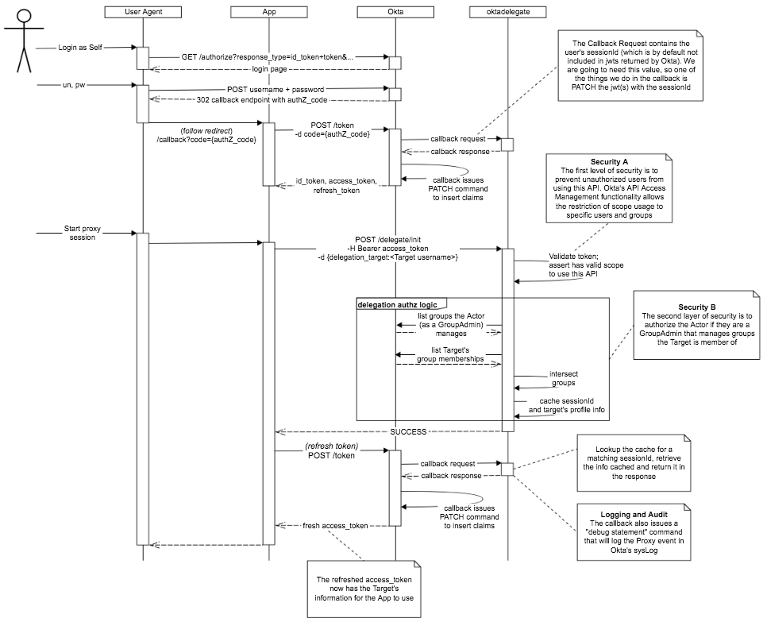

# Introduction
A "Proxy Login" function is the application's ability to provide a privileged actor the ability to *"impersonate"* another subject. The general requirement is to generate tokens – having identity and claims – on behalf of a subject without the subject's interaction.

## Terminology
We will use the following terminology to avoid confusion when referring to the different personas involved in the proxy login scenario:

| Term   | Description                                                        |
|--------|--------------------------------------------------------------------|
| Actor  | The privileged user that is authorized to proxy login another user |
| Target | The user who is subject to the proxy login event                   |

Okta supports this capability by providing readily available tools and functionality out of the Okta platform; allowing customers to properly implement – with the goals of security and audit-ability in mind –  proxy login for a variety of use-cases.

## Code Flow
For illustration, the diagram below shows an application using OAuth2 Authorization Code flow with Okta as the Authorization Server. This sample **Express** project provides 2 endpoints that you can add to your Application backend 
* POST /delegate/init - Authorizes the Actor to Proxy a specific Target. Reads Target information and caches it in session for the callback response.
* POST /delegate/hook/callback - Updates the access_token with the Target information cached during the /delegate/init call (which is only present if the Actor is authorized)

For clarity, these 2 endpoints appear as a standalone `oktadelegate` service, separate from the Application backed (Instructions on how to deploy this project as a standalone is provided below). Running the service standalone is an option and good during a POC. One could alternatively refactor the code into App's server/backend code and expose the 2 endpoints.

